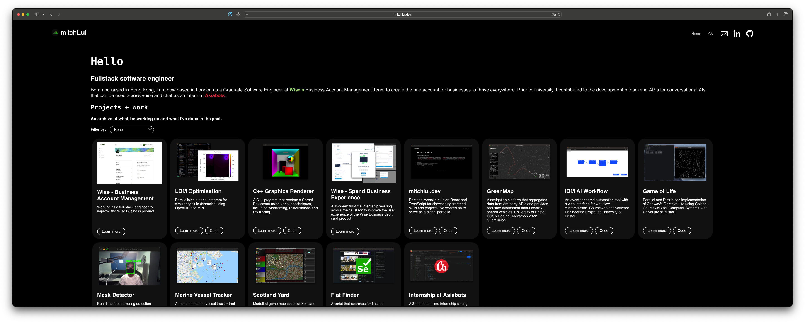

# 1. mitchlui.dev

- [1. mitchlui.dev](#1-mitchluidev)
  - [1.1. Introduction](#11-introduction)
  - [1.2. Development](#12-development)
  - [1.3. Deployment](#13-deployment)

## 1.1. Introduction

URL: [https://mitchlui.dev][1]

This website is a personal website for myself and is used for documenting my projects and serve as a digital portfolio.

The site is built on [React.js][2] and is currently hosted on [Namecheap][3].

## 1.2. Development

Install [npm][4] and run `npm install`.

## 1.3. Deployment

You can build the site and deploy it statically to any hosting service you'd like by running `npm run build` and serve the files according to the service's documentation.

---
[1]:https://mitchlui.dev
[2]:https://reactjs.org
[3]:https://www.namecheap.com
[4]:https://www.npmjs.com